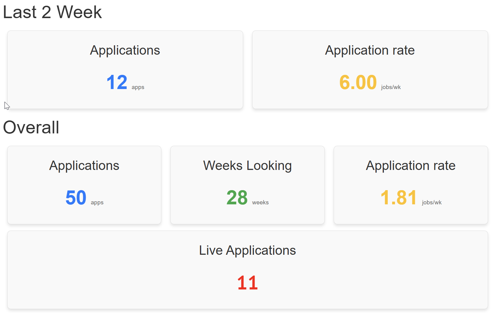
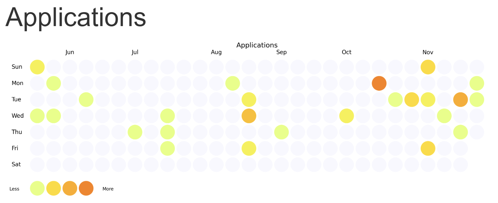

# Job Tracker
*last updated: 27/11/25*

Applying for jobs can take time and when you're out of work it can be difficult to keep track. To make sure I knew what I had applied for, I tracked all my applications in a simple JSON array. As more things happened, I started to track them: interviews, rejections, sending CV's to recruiters. After a little while, I had a series of events that I could begin to analyse and see if I could improve on my application strategy.

I started this Marimo notebook to do some analysis on my applications and now I've built it up to add in some interactive components that allow me to log new. The intention is to build this and find out what's working when applying for jobs and what isn't.

## Data Structure

### Events Entries

When I started recording applications and other event (when I remembered) I added each event to a JSON array with the below format:

```
{
    "type": "Interest", # Type is usually one of the type options
    "date": "2025-05-27", # Date the event occured
    "company": "Comapany X", # Who does the event relate to
    "job_title": "", # What was the job title (if any)
    "notes": "Registered interest in a role" # Any notes to add to the event
}
```

Using an array of these objects, I created by base dataframe ad filtered for applications. To find out how an application was going, I filtered for all other types (you're never going to apply for the same job twice!), found the latest event for each combination of company and job_title and then jointed both lists of applications and other events together. This provided new fields: "last_updated" telling us when the latest event was; "latest_notes" giving us the lastest comments; "stage" showing the type of the latest events.

Performing this join allowed me to keep applications 'alive' in the notebook, creating features to determine if there was a 'rejection' event or if the last update was greater than 3 week (most companies don't reply so you have to kill an application at some point!).

### Event Types

The event types have been broken down into a few different types:

```
[
    'Application', # For new applications
    'Rejection', # For when companies have the courtesy to reply!
    'Interest', # For 'interested in' applications to companies that don't currently have positions
    'Recruiter', # For when you contact a recruiter or send them a CV
    'Interview', # For logging interviews or assessments
    'Offer' # For receiving an offer
]
```

This list can of course be added to (I might add in 'Accepted' and add a kill switch to the notebook that just displays 'congratulations!') but for now, this is working.

## Basic Stats

The first simple bit of analysis I did was to figure out how many applications I've tracked and the rate at which I've applied for things. This helps to keep a focus, almost gamify the application process to keep the application rate high. Filtering out applications by date, their type, and setting up an auto close out for applications (automatically setting the status to rejected after 3 week), allowed me to track the simple stats over the last 2 week and overall. 

Keeping the 2 week average above the overall prevents me from lapsing on applications!



## Applications

Adding some visuals into the notebook allowed me to keep on top of when I was making applications. I wanted to make sure I put something in each week so I could maintain the number of live applications.



## Input Form

Originally I would add in new events by opening the JSON and editing it. Rather than flicking between files, I wanted to add in an input form that I could use straight from the notebook. This worked, but the images and dataframes wouldn't update when new information was added. To get round this, I turned the data cleaning and plot cells into functions and added triggers that rerun all these functions once the submit button was clicked.


## More Information

For more information about marimo, go to [marimo.io](https://marimo.io/)
